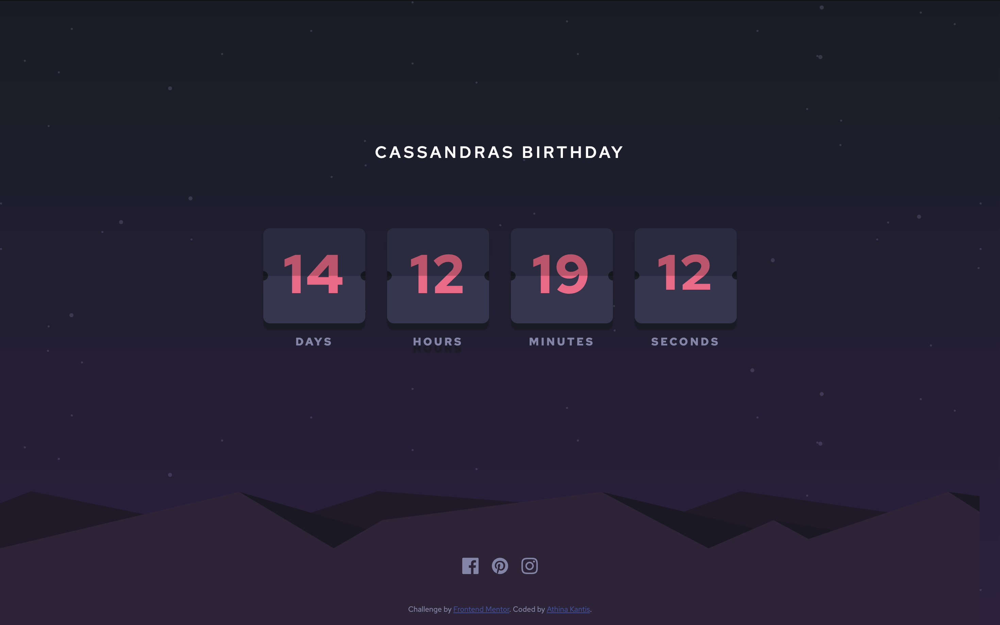

# Launch Countdown Timer Solution by Athina Kantis

I decided to do a slightly different take on this challenge as I was inspired by my nieces upcoming birthday and wanted to do something fun leading up to it. 
Besides the countdown it shows a fun firework animation that will only render during her birthday 
[Original Launch Countdown Challenge](https://www.frontendmentor.io/challenges/launch-countdown-timer-N0XkGfyz-)

## Table of contents

- [Overview](#overview)
  - [The challenge](#the-challenge)
  - [Screenshot](#screenshot)
  - [Links](#links)
- [My process](#my-process)
  - [Built with](#built-with)
  - [Continued development](#continued-development)
  - [Useful resources](#useful-resources)
- [Author](#author)

## Overview

### Screenshot

### The challenge

Users should be able to:

- See hover states for all interactive elements on the page
- See a live countdown timer that ticks down every second (start the count at 14 days)
- **Bonus**: When a number changes, make the card flip from the middle

### Links

- [Source Code](https://your-solution-url.com)
- [Live Page](https://your-live-site-url.com)

## My process

### Built with

- Semantic HTML5 markup
- CSS custom properties
- Flexbox

### Continued development

I definitely want to use this project to look at what others have done differently and take something away from that.

### Useful resources

- [Countdown how-to by W3Schools](https://www.w3schools.com/howto/howto_js_countdown.asp) - for the Countdown logic

## Author

- Frontend Mentor - [@athinakantis](https://www.frontendmentor.io/profile/athinakantis)
- Github - [@athinakantis](https://github.com/athinakantis/)
